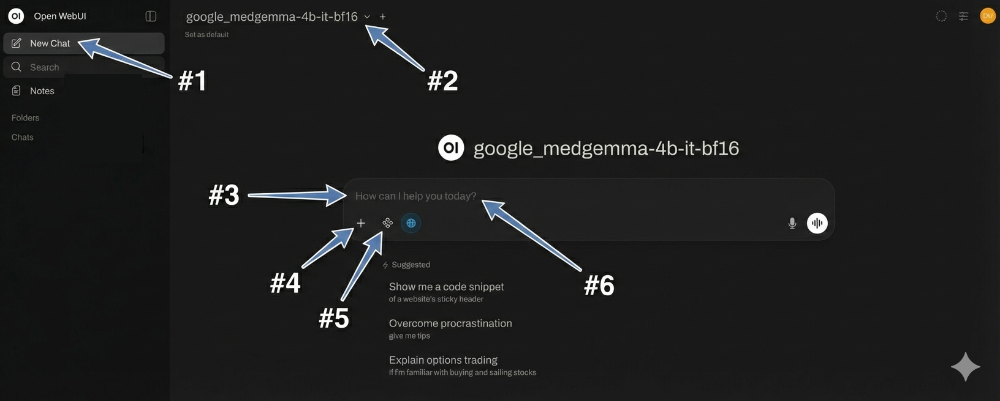

# ChatDNP  
```{Important}
This AI chatbot service is currently free and in beta / demo mode. In the future, it will be a paid service. Your chat prompts will be used for our internal research to improve the DNP's offerings. We do not use or analyze any scientific data you share.

```
ChatDNP is the Douglas Neuroinformatics Platform’s (DNP) local AI chat service, powered by Open WebUI and accessible on our on-premise GPU server. It is equipped with:

- 2 × NVIDIA RTX A6000 (each with 48 GB VRAM)
- 500 GB system RAM
- Dual Intel Xeon Gold 6526Y (32 cores / 54 threads)
- 2 NUMA nodes

### Why have a local (Institution) chat?

- **Privacy:** Keeps sensitive discussion inside the institutional boundary. Ability to include anonymized participant info and files in chats.
- **Performance:** Dedicated GPUs for low-latency responses.
- **Control:** Model selection, updates, and administration are managed by DNP.

### Who can use it

- Anyone on the Douglas Research Centre internal network.
- External access is not available.

### How to sign in

1. Navigate to chatDNP: https://chatdnp.douglas.rtss.qc.ca
2. Accept the privacy warning of the site not being secure (we use self-signed certs not open to the web)
2. Read the disclaimer and accept our terms of use.

### Privacy & Data Use

Your chat prompts and responses are recorded so we can improve the platform. **Please do not paste credentials, tokens, or personal passwords.** Some important things to consider:

- **Recorded:** We store chat history and usage analytics for quality, security, and capacity planning.
- **Visible to others:** The platform uses a single shared account and your chats are visible to other users.
- **Retention:** Chats are automatically deleted every hour. Please save your outputs immediately.
- **Research data:** We do not use or analyze your scientific datasets. You may discuss patient-sensitive or confidential topics because the service runs entirely inside the Douglas network.
- **Future billing:** The service is free in beta, and will become paid later.
- **API access:** Disabled by default, it is only available to authorized projects.
- **Private chat account:** Should you require your own private chat, please contact us detailing the specifics.

### Open WebUI Quick Start Usage

1. Start a new chat by clicking the **New chat** button (top left pane).
2. **Select a model** from the drop-down list (top centre of the chat window).
3. Ask one thing at a time using short, specific prompts.
4. Provide context for the chat by describing your task or **attaching files**.
5. Toggle the **web search** integration on/off depending on if your model needs it.
6. Iterate. If the answer isn’t right, ask it to try again (e.g. "Simplify and summarize it in 100 words").


**For a deeper look into all of Open WebUI’s features, consult their docs:** https://docs.openwebui.com
