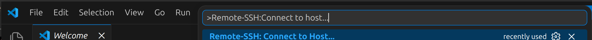
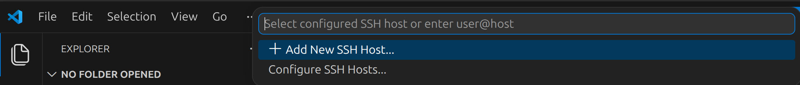
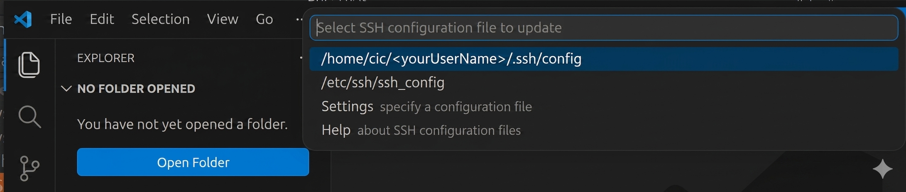
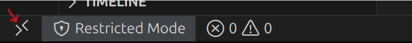
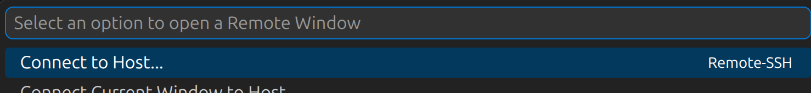
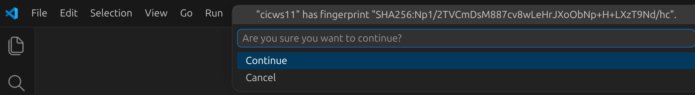

# Accessing the System

The platform can be accessed in a number of ways:

1. Physical access
2. Remote access within the Douglas

## Physical Access

Physical access to a suite of workstations is available inside the Douglas CIC,
contact the CIC Administrative Assistant (Louis Théroux) <louis.theroux.comtl@ssss.gouv.qc.ca> for keycard access.

## Remote Access within the Douglas

All platform hardware is accessible within the Douglas Research Centre network
via `ssh`. The main user server is available at `cicus03`, the storage server
at `cicss05` and workstations are available in the range `cicws[01..48]` and
`dnpws[01..12]`.

```{admonition} Playing nice
Neuroinformatics workstations all allow for multiple simultaneous users, please
make a best effort to choose a workstation not already being used by others.

The command [`who`](https://linuxize.com/post/who-command-in-linux/) can list
currently logged-in users, while [`htop`](https://htop.dev/) will show
a graphical display of the current state of CPU and Memory utilization.

In general, fewer users is better, as well as low CPU and
memory utilization (represented by the length of the horizontal coloured bars
in `htop`)

```

### Graphical Access

In addition to shell access on workstations via SSH, access to a full graphical
desktop is available via [X2GO](https://wiki.x2go.org/doku.php) which rides on SSH.
Install the local client, create a connection to a workstation and specify
the LXDE desktop type for a minimal-graphical-features remote desktop
with features equivalent to sitting at a workstation.


### Connecting via VS CODE

To use VS Code’s **Remote-SSH** feature to connect to internal hosts, it is **imperative that you avoid connecting directly to** `cicus03`.

```{admonition} Notes on Connecting via the Gateway
When connecting to the gateway directly, you are automatically redirected to `cicus03`.  
To access a different host (e.g., `cicws01`), you **must** use the jump host flag (`-J`) and explicitly specify the desired destination in your SSH command.
```

Please follow these steps to properly configure VS Code’s Remote SSH extension:

1. Open **Visual Studio Code**
2. Press `F1` (or `Ctrl+Shift+P`) to open the **Command Palette**
3. Type and select: `Remote-SSH: Connect to Host...`

4. Click on: `Add New SSH Host...`

5. When prompted, enter the following command:
   ```
   ssh yourUserName@cicWorkstation
   ```
   OR
   ```
   ssh -A -J yourUserName@GatewayHost:portNumber yourUserName@cicWorkstation
   ```
```{Important}
Replace `yourUserName`, `GatewayHost`, and `portNumber` with your desired values.
```
6. Select a file to store this configuration to.

7. Click on the **Open a Remote Window** icon located at the bottom left of the editor.

8. Select **Connect to Host...**

9. When prompted, select **Linux** as the platform, and answer fingerprint and password prompts.

10. You can verify that you are connected to a host in the bottom left-hand corner.


