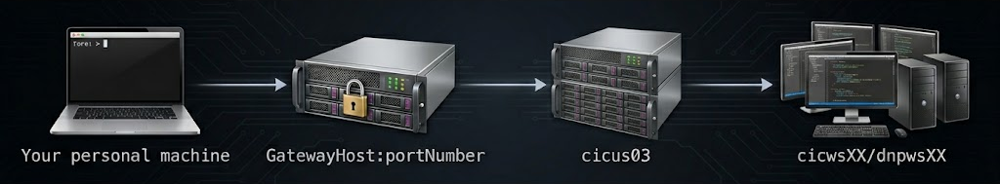
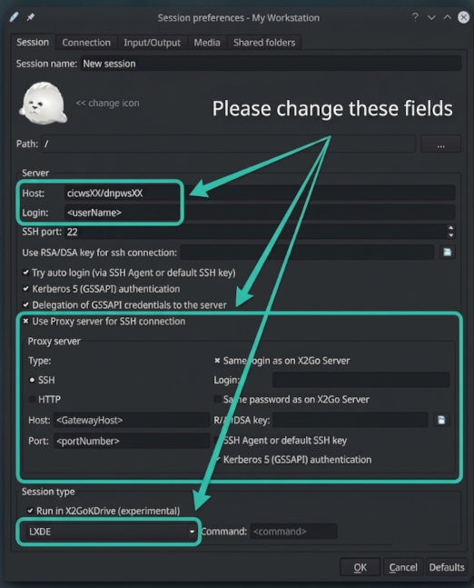
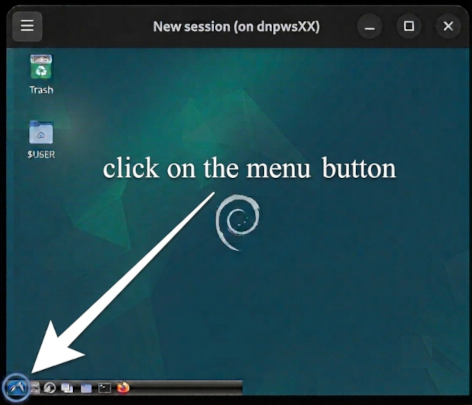
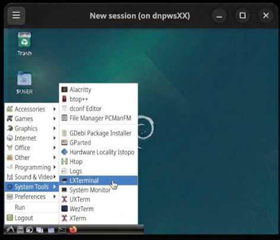

# Remote Access (from outside the Douglas)

This page describes how to work with the Douglas Neuroinformatics Platform (DNP/CIC)
**from outside the Douglas Research Centre network** from any off-site location.

If you are connecting from a machine already on the Douglas network,
**you do not need the gateway**. Follow {ref}`Accessing the System<using_the_system/access_to_system:accessing the system>` instead.


```{admonition} Your gateway address and port
:class: important

Throughout this page, `GatewayHost` and `portNumber` are **placeholders**.
The real gateway hostname and SSH port were sent to you in the **onboarding email
you received when your account was created**
```

## How remote access works

From outside the Douglas, the platform is reached through a single public **gateway**
that listens for `ssh` on a non-standard port (`portNumber`). Logging in to the
gateway places you on the user server `cicus03`. From there, you should then log in to an available **workstation**
(ideally the one you usually sit at), named cicwsXX/dnpwsXX.  Its hostname can be found in the terminal or on a
sticker located on the physical machine.



## Prerequisites:  SSH Client

In order to access machines remotely, you need a `ssh`/`rsync` client installed on your local machine.

- **Linux**: `ssh` and `rsync` are available out of the box, and graphical (X11)
  support is included.
- **MacOS**: `ssh` and `rsync` are available in the Terminal. For remote graphics, install [XQuartz](https://www.xquartz.org/).
- **Windows**: install
  [MobaXterm (Home Edition)](https://mobaxterm.mobatek.net/download-home-edition.html),
  which provides a Linux-like terminal with `ssh` and `rsync` and built-in graphics
  support.
  - Use **"Start local terminal"** in MobaXterm — **do not use the graphical "SSH" session option**.
  - Depending on the version you installed, MobaXterm may prompt you to install a missing
    plugin the first time; allow it.

## Connecting to the gateway via a terminal (SSH)

Log in to the gateway using the alternate port to get onto cicus03, and then SSH into your workstation with the following command:

```{code-block} bash
$ ssh -p portNumber <username>@GatewayHost
<username>@cicus03 $ ssh cicwsXX
<username>@cicwsXX $
```

*Replace `<username>`, `cicwsXX`, `GatewayHost`, and `portNumber` with your own values.*

### Streamlining with ProxyJump

If your SSH client is recent enough, you can reach your workstation in a single command
using `-J` (ProxyJump), which uses the gateway purely as a jump host:

```{code-block} bash
$ ssh -J <username>@GatewayHost:portNumber <username>@cicwsXX
```

````{admonition} Pro tip - save it in your SSH config
:class: tip

To avoid retyping the jump host every time, on your personal machine, add the following to `~/.ssh/config`:

```{code-block} text
Host cic
    HostName cicwsXX
    User <username>
    ProxyJump <username>@GatewayHost:portNumber
```

Then simply run `ssh cic`.
````

## Transferring data remotely

Data transfers are easiest with [`rsync`](https://linux.die.net/man/1/rsync), which
supports resuming interrupted transfers. The following are example commands to be **run on your personal computer**
to send data to and from the DNP:

```{code-block} bash
# Copy FROM your personal machine TO the DNP
$ rsync -avz -e 'ssh -p portNumber' /path/to/local/files/* <username>@GatewayHost:/path/to/save/files

# Copy FROM the DNP TO your personal machine
$ rsync -avz -e 'ssh -p portNumber' <username>@GatewayHost:/path/to/remote/files /path/to/save/locally
```

Note: Regular globbing (`*`) and other shell tricks work as expected over `rsync`.

````{admonition} External data transfers to the DNP must be initiated from the DNP
:class: warning

Do not log into an external system, such as a [Digital Research Alliance of Canada (DRAC)](https://www.alliancecan.ca/en) server, and PUSH data to DNP using rsync or similar tools.

Any data transfer between an external system (e.g. Niagara/Beluga/Trillium) and the DNP must be initiated from a DNP computer. **In practice, this means you should log into a DNP workstation or server and run the transfer from there**.

```{code-block} bash
# COPY data (PUSH) from a DNP machine to a DRAC server
$ rsync -avz /path/to/files/on/cic <username>@niagara.computecanada.ca:/path/to/save

# RETRIEVE data (PULL) from a DRAC server to a DNP machine 
$ rsync -avz <username>@niagara.computecanada.ca:/path/to/files/on/drac /path/to/save
```
````
```{admonition} Graphical transfer tools (Windows)
:class: info

Windows users who prefer a graphical interface can use
[WinSCP](https://winscp.net/eng/download.php) or
[FileZilla](https://filezilla-project.org/) (remember to set the custom port `portNumber`).
If you use MobaXterm to reach files on your local Windows machine, see the
[MobaXterm documentation on paths](https://mobaxterm.mobatek.net/documentation.html#2_2_3).
```

## Running software remotely

Once you are on your workstation, the terminal and the
{ref}`software modules<using_the_system/access_to_software:access to software>`
behave exactly as they would if you were sitting at the machine. Run individual
commands directly, or submit jobs with `qbatch`.

```{admonition} Keep long jobs alive with tmux or screen
:class: important

A dropped network connection will kill any foreground command. Run long jobs inside a
terminal multiplexer with the ['tmux'](https://linuxize.com/post/getting-started-with-tmux/)
or ['screen'](https://linuxize.com/post/how-to-use-linux-screen/) commands (both are installed) -
so they keep running after you disconnect, and you can reconnect to them later.
```

For MATLAB without the GUI, start it with:  `matlab -nodesktop`

## Remote graphics (X11 forwarding)

Linux can forward graphical applications back to your machine over SSH, but a number of moving parts must be
coordinated:

1. You need a local X server: **MobaXterm** on Windows, **XQuartz** on macOS; Linux has
   everything already.
2. Connect **directly to your workstation** through the gateway as a jump host, adding
   `-Y` to enable trusted X11 forwarding:

```{code-block} bash
$ ssh -Y -J <username>@GatewayHost:portNumber <username>@cicwsXX
```

If you are on an older SSH version, you may need the
[workaround described here](https://superuser.com/a/1204734/1113768).

For 3D/OpenGL software (like `Display` from the minc-toolkit), after opening your terminal run `module load remotemesa`.
However, if you connected with X2Go, don't load the module and use the `vglrun <command>` instead.

```{admonition} Expect it to be slow
:class: note

X11 forwarding sends rendering instructions over the network and will be slow regardless
of your connection. For an interactive desktop, use **X2Go** instead.
```

## Remote desktop access with X2Go

[X2Go](https://wiki.x2go.org/doku.php) gives you a full graphical desktop on your
workstation and is far more responsive/faster than raw X11 forwarding. To use it, Install the
[X2Go client](https://wiki.x2go.org/doku.php/doc:installation:x2goclient) on your personal computer, and then create a
new session with the settings highlighted below (use **your** username and workstation):



**Pick a workstation you normally use and set the Display resolution (1024×768 or higher) for a usable desktop.**

```{admonition} Sessions survive disconnects
:class: tip

If your connection drops or you close the X2Go window, your session and programs keep
running on the workstation — just reconnect to resume where you left off.
```

For 3D software in a fresh install, launch it with `vglrun <command>`. Personal tunnel
users (see below) should instead set the **Server** to `localhost` port `19999` and
**skip** "Use Proxy server".

### Opening a terminal inside the X2Go desktop

Once the LXDE desktop loads, open the application menu in the bottom-left corner:



Then choose **System Tools → LXTerminal** to get a command-line terminal:



## Working on your own machine

If you would rather process data locally, a couple of options approximate the CIC
environment:

- **[MINC-VM](https://github.com/CoBrALab/MINC-VM)** is a virtual machine (a "computer in
  a box") that contains an approximation of the CIC modules. Run it with
  [VirtualBox](https://www.virtualbox.org/wiki/Downloads); prebuilt images are at
  [packages.bic.mni.mcgill.ca](https://packages.bic.mni.mcgill.ca/virtual-machines/).
  Additional packages such as AFNI and FSL can be installed inside the VM via NeuroDebian
  (`apt-get install ...`).
- **MATLAB** is available to McGill members through the
  [TAH portal](https://www.mathworks.com/academia/tah-portal/mcgill-university-30521249.html).

```{admonition} Support for personal machines is limited
:class: note

Personal machines vary enormously, so support is limited. **Most neuroscience software
is not available on Windows**. Email [support@douglasneuroinformatics.ca](mailto:support@douglasneuroinformatics.ca) to get help finding software.
```

## Staying in touch with the lab

Labs function better with everyday communication/banter and regular contact with your supervisor.

- **Slack** and **Mattermost** are great tools for day-to-day chat (alternatives: Microsoft Teams & Discord).
- For group video meetings, **Zoom** has tested best in practice. Note the free tier
  limits group meetings to 40 minutes.

## Verify your setup

As a quick test that everything is working end to end:

- Log in to your workstation:
   `ssh -p portNumber <username>@GatewayHost` then `ssh cicwsXX`
- Create and edit a text file:
   `nano /scratch/$USER/test.txt`
- Copy the file to your home machine (rsync, WinSCP, or FileZilla) and edit it
    with a local editor.
- Copy the file back to the DNP and confirm your changes with
   `cat /scratch/$USER/test.txt`.

## Using the Alliance / Compute Canada

If your lab has a DRAC / Compute Canada account, remote work can also be done there
using the Alliance modules; access and data copying use the same `ssh`/`rsync` tools described above.

CIC-like tools are hosted on Niagara and Trillium via the `mchakrav` group. For access and assistance in getting software set up there, contact
[support@douglasneuroinformatics.ca](mailto:support@douglasneuroinformatics.ca)


## Advanced: your own personal DNP tunnel

```{admonition} For experienced Linux users
:class: warning

External users share a single tunnel into the CIC. The CIC has plenty of *outgoing*
bandwidth, so if you run **Linux at home** you can set up a dedicated outgoing tunnel just
for yourself. This is a fairly technical solution — attempt it only if you are comfortable
with Linux networking.
```

**1. Prepare your home machine** to accept SSH and make it reachable from the internet:

```{code-block} bash
# On your home machine
$ sudo apt install openssh-server -y
# find your machine's local IP
$ ip addr
```

Configure your router to forward port `22` to that local IP, and find your external
(internet) IP address (e.g. ask a search engine "what is my ip address").

**2. From your CIC workstation, open a reverse tunnel** back to your home machine. Run it
inside `tmux`/`screen` so it survives disconnects:

```{code-block} bash
# On your CIC workstation
$ tmux
$ ssh -R 19999:localhost:22 <yourHomeUser>@<yourHomeInternetIP>
```

**3. Use the tunnel from your home machine** via local port `19999`:

```{code-block} bash
# On your home machine
$ ssh -p 19999 <cicusername>@localhost
$ rsync -avz -e 'ssh -p 19999' <cicusername>@localhost:/path/to/files /path/to/save/locally
$ rsync -avz -e 'ssh -p 19999' /path/to/local/files <cicusername>@localhost:/path/to/save/files
```

Personal tunnel users can also point the X2Go client at `localhost` port `19999` (with the
proxy server disabled) for a remote desktop.
